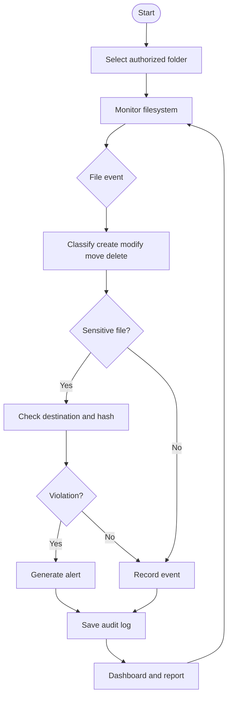

```mermaid
flowchart TD
 A([Start]) --> B[Select authorized folder]
 B --> C[Monitor filesystem]
 C --> D{File event}
 D --> E[Classify create modify move delete]
 E --> F{Sensitive file?}
 F -->|Yes| G[Check destination and hash]
 F -->|No| H[Record event]
 G --> I{Violation?}
 I -->|Yes| J[Generate alert]
 I -->|No| H
 J --> K[Save audit log]
 H --> K
 K --> L[Dashboard and report]
 L --> C
```